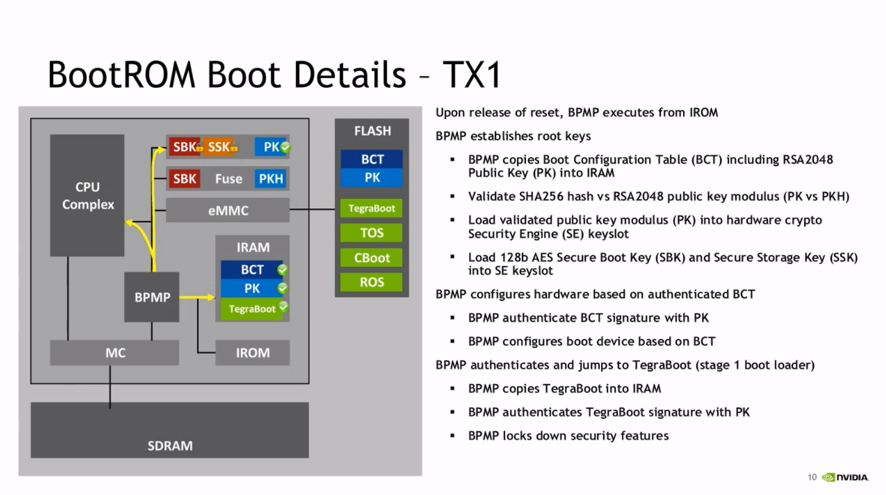
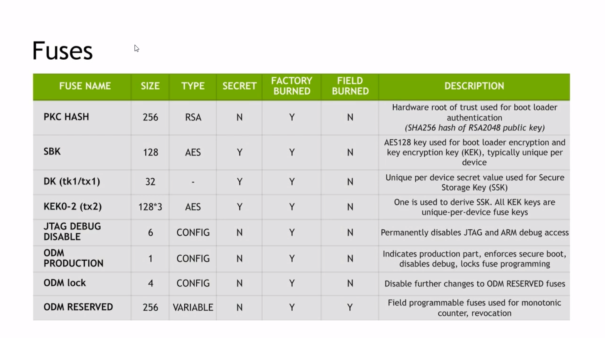

# Nintendo Switch 破解原理:详解 Fusée Gelée 漏洞
> 本文最初发布于知乎，后被知乎以毫无根据的理由删除。  
若文章就此消失，无益于知识传播，故移步至此。  
以下是原文。

---

> Fusée Gelée漏洞报告中，已经给出了相当详细的信息，但在阅读当中还是遇到一些障碍，例如USB协议相关的知识、Tegra RCM通讯相关的知识。本文并非翻译，旨在补充说明报告中需要进一步解释的内容，伪代码也做了进一步注释，以帮助读者绕过一些坑，结合报告服用更佳，在文章的前面先介绍一下背景知识，后面再解释原理。

## 背景知识

背景知识稍作了解即可，可以在正文遇到问题时再查阅，这些背景知识有助于理解设备boot ROM中的代码逻辑。


任天堂的Switch采用了Nvidia的Tegra X1 （model T210）芯片，漏洞就出在这块芯片的boot ROM上。

***Tips:*** *boot ROM 中存放了用于启动设备的初始化代码，而执行这段初始化代码由boot CPU负责，与之相对的是设备运行起来后负责执行一般应用程序的 main CPU complex，NV文档中称后者为 CCPLEX。*

**Tegra SoCs的启动过程**

这里先简单介绍下流程：

1. Tegra SoCs 通电之后，boot CPU 开始执行 boot ROM 中的代码。
2. boot ROM 首先决定执行代码所需要的内存芯片，对于出厂的设备而言，一般都是固(xie)化(si)的。
3. 内存决定下来后，开始读取启动配置表([Boot Configuration Table](https://http.download.nvidia.com/tegra-public-appnotes/bct-overview.html) 简称 BCT，简要说明见下方Tips)。
4. 如果读取BCT失败，那就会进入**USB恢复模式 （Recovery Mode, NV文档中简称为RCM）**
5. 如果BCT存在，就会读取它。
6. 根据BCT的配置，如果没找到有效的bootloader（见下方Tips），那么也会进入**USB恢复模式。**
7. 如果找到了bootloader，那么控制权就会转移至bootloader。


***Tips:*** *bootloader是用于启动操作系统的代码。*

***Tips:*** *BCT中提供了配置信息，用于配置boot memory，配置SDRAM（如果有需要的话，bootloader一般都会加载到SDRAM中），表明bootloader镜像的位置，bootloader加载到的内存地址，指定bootloader的入口。*

**进入RCM的几种情况**


- 启动过程发生错误，例如：没找到BCT、BCT哈希验证失败、bootloader哈希验证失败
- 预设组合键 （Switch上是短接右侧Joy-Con导轨中10pin与1、7、9pin其中之一后按住音量+ 和 电源键开机）
- 启动的时候Tegra PMC寄存器scratch0的bit 2被设置，这个比特位在重启时不会被重置，因此- 操作系统可以通过设置这个比特位，重启，进入RCM

破解时采用的是组合键的方式，毕竟这种方式最简单。

**Tegra RCM 可以做什么？**

Tegra的bootloader实现的RCM协议很简单，主要功能就是通过USB读取一段代码（叫做miniloader或applet或payload）到bootloader的IRAM（BPMP的专用内存，BPMP就是TX1的boot CPU全称Boot and Power Management Processor）中执行。一般会通过这种方式加载更高级一点的程序用于刷机、检查、奇怪的姿势启动操作系统等。

**更多关于Tegra的资料，可以参考[Nvidia的文档](https://http.download.nvidia.com/tegra-public-appnotes/tegra-boot-flow.html)。**

---

## 漏洞原理

USB恢复模式在所有Tegra设备上都存在，包括发行出来的商业产品，在USB恢复模式下可以做很多"危险"的事情（例如刷自定义固件、破解系统），因此USB恢复模式的命令在发行版中一般都需要RSA或AES-CMAC签名(这种模式叫做安全模式，secure mode)，确保只能执行设备开发商的签名后的代码（例如任天堂可以通过USB恢复模式，抢救软件故障导致变砖的设备）。

**漏洞出现在签名验证之前，同时设备的保护状态未启用，相当于利用漏洞可以获到设备的完全访问权限。**

漏洞报告中给出了部分根据IROM（BPMP的专用ROM）逆向出来的伪代码。注释中有笔者的补充说明。
```C
// If this is a warmboot (from "sleep"), restore the saved state from RAM.
// 如果是热启动（从休眠模式恢复），恢复保存起来的内存状态
if (read_scratch0_bit(1)) {
  restore_warmboot_image(&load_addr);
}
// Otherwise, bootstrap the processor.
else
{
  // Allow recovery mode to be forced by a PMC scratch bit or physical straps.
  // 处理上文提到的进入RCM的其中两种情况
  // 组合键 或者 stratch0 bit2被设置
  force_recovery = check_for_rcm_straps() || read_scratch0_bit(2);

  // Determine whether to use USB2 or USB3 for RCM.
  determine_rcm_usb_version(&usb_version);
  usb_ops = set_up_usb_ops(usb_version);
  usb_ops->initialize();

  // If we're not forcing recovery, attempt to load an image from boot media.
  // 如果不是强制进入RCM就执行正常启动流程
  if (!force_recovery)
  {
    // If we succeeded, don't fall back into recovery mode.
    // 执行成功就跳转到启动成功流程，启动设备的安全保护跳转到load_addr执行bootloader
    // 如果失败就继续执行，走read_boot_images_via_usb_rcm流程
    if (read_boot_configuration_and_images(&load_addr) == SUCCESS) {
      goto boot_complete;
    }
  }

  // In all other conditions
  // 除非read_boot_configuration_and_images成功，其他情况都会进入usb rcm流程
  // 漏洞产生在这个函数调用中
  if (read_boot_images_via_usb_rcm(<snip>, &load_addr) != SUCCESS) {
     /* load address is poisoned here */
  }
}

boot_complete:
  /* apply lock-outs, and boot the program at address load_address  */
```

漏洞产生在 read_boot_images_via_usb_rcm 这个函数调用中，以下是该函数的伪代码，伪代码省略了错误检查之类的对于理解漏洞无关的部分。

```C
// Significantly simplified for clarity, with error checking omitted where unimportant.
while (1) {
  // Repeatedly handle USB standard events on the control endpoint EP0.
  // 处理USB endpoint 0上的标准USB事件
  // 关于endpoint正文中补充说明
  // 可以先把endpoint当作成TCP/UDP的端口号来理解
  usb_ops->handle_control_requests(current_dma_buffer);

  // Try to send the device ID over the main USB data pipe until we succeed.
  // 在USB endpoint 1（RCM endpoint, 报告中的注释又称其为main USB data pipe）
  // 上发送发送设备ID, 直到成功
  if ( rcm_send_device_id() == USB_NOT_CONFIGURED ) {
    usb_initialized = 0;
  }
  // Once we've made a USB connection, accept RCM commands on EP1.
  // 一旦设备id发送成功后从EP1（endpoint 1)接收RCM命令
  else {
    usb_initialized = 1;

    // Read a full RCM command and any associated payload into a global buffer.
    // (Error checking omitted for brevity.)
    // 把完整的RCM命令与其payload读到一个全局buffer中
    rcm_read_command_and_payload();

    // Validate the received RCM command; e.g. by checking for signatures
    // in RSA or AES_CMAC mode, or by trivially succeeding if we're not in
    // a secure mode.
    // 校验接收到的RCM命令有效性(采用RSA或AES-CMAC签名)
    // 如果没有开启secure mode就不校验，一般只在产品开发阶段使用
    rc = rcm_validate_command();
    if (rc != VALIDATION_PASS) {
      return rc;
    }

    // Handle the received and validated command.
    // For a "load miniloader" command, this sanity checks the (validated)
    // miniloader image and takes steps to prevent re-use of signed data not
    // intended to be used as an RCM command.
    // 执行通过了校验的RCM命令
    rcm_handle_command_complete(...);
  }
}
```

---

注释中有提到USB endpoint。

**USB endpoint 是什么？**

endpoint是USB数据传输时用到的概念，[微软的文档](https://docs.microsoft.com/en-us/windows-hardware/drivers/usbcon/usb-endpoints-and-their-pipes)中是这么解释的：

> An endpoint is a buffer on a USB device

endpoint是USB设备上的一块缓冲区。

举例来说，主机（例如你的电脑）要和USB设备（例如U盘）通过EP1（Endpoint 1）通讯。

如果数据是从主机流向设备的，那么数据其实会写到EP1 OUT缓冲区，为什么是OUT呢？USB是host centric的，也就是说所有概念都是以主机为视角的，数据从主机流向设备，就是一个输出的过程，因此是OUT。写入EP1 OUT后，设备上的固件会从EP1 OUT上读取。

如果数据是从设备流向主机呢？USB设备是不能直接往总线写数据的，USB的总线由主机控制，什么时候读，什么时候写都由主机决定，USB设备要往主机传输数据的话，把数据写到EP1 IN缓冲区，主机在轮询到该设备的时候会把数据传输到主机内存。

Endpoint有多种不同的类型（control, interrupt, bulk, isochronous），用途也有所区别。各种不同类型的特性说明可以参考这篇——[此处是传送门](https://www.beyondlogic.org/usbnutshell/usb4.shtml)。

USB设备必须要提供control类型、支持双向传输的EP0，EP0用于获取设备信息、配置设备、执行控制操作。

**Tegra 的RCM协议通过EP1传输，bulk类型。**

***Tips:*** *bulk 传输模型的特点，带错误校验，带宽没有保证，其他操作优先，剩下的带宽用于bulk传输，不保证最小延迟。*

---

到这里，先回顾下之前的代码流程，首先检查是否进入RCM （USB恢复模式），在RCM中是一个 while (1)循环，不断处理EP0上的标准USB事件，不断尝试通过EP1向主机发送设备id直到成功。发送设备id成功的话，从EP1读取RCM命令，校验RCM命令并执行。

接着看 **rcm_read_command_and_payload** 函数，这是函数是**主要受灾区**。

**该函数负责从EP1读取命令，把命令及数据拷贝到设备内存。**

为了便于解释代码，这里需要先说明下RCM的通讯协议，通讯协议可以参考Nvidia提供的 [tegrarcm](https://github.com/NVIDIA/tegrarcm) 的实现，tegrarcm的实现兼容到K1(T124)，X1(T210)并不包含在内，但是依然有参考价值。RCM相关的代码都再rcm.h和rcm.c中。

**RCM的消息由三部分组成：message、payload、padding**

- message 是与版本号对应的 rcm_msg_t 结构，例如 RCM_VERSION_1 则对应 rcm1_msg_t【长度为sizeof(rcm1_msg_t)】，**其中首4字节代表总长度=消息结构体大小+payload大小**
- Payload 用来加载到设备内存的代码块
- Padding 【长度可变】保证总长度不低于1024(0x400)字节，根据签名算法需要对齐payload——16字节对齐
- 其中payload和payload的padding是optional的，需要根据message决定。

```C
// 已经接收到的字节数
uint32_t total_rxd  = 0;
// 总共需要接收的字节数
// 0x400 == 1024
// 为什么是1024? 没太多为什么其实大于等于4后面的代码就可以正常执行了
// 由于根据协议,最小尺寸是1024,上来直接接收1024字节是不会错的
uint32_t total_to_rx = 0x400;
 
// Loop until we've received our full command and payload.
// 循环读取直到接收到完整的命令和payload
// total_to_rx的数值会根据后面读到的消息总长度修正，最终循环退出时保证数据一定接收完成
while (total_rxd < total_to_rx) {
  // Switch between two DMA buffers, so the USB is never DMA'ing into the same
  // buffer that we're processing.
  // 读取的操作是异步的, 这里使用了双重缓冲
  // active_buffer用于bulk异步读取
  // next_buffer存储了上一次循环读取到的数据, 在当前循环中进行数据处理
  // 首次进入这个while循环时由于total_rxd == 0, next_buffer不会被用到
  active_buffer = next_buffer;
  next_buffer   = switch_dma_buffers();

  // Start a USB DMA transaction on the RCM bulk endpoint, which will hopefully
  // receive data from the host in the background as we copy.
  // 开始异步bulk读取，数据读入active_buffer，至多读取0x1000个字节
  // 0x1000 == 4096
  // 为什么是4096呢? 一定要问为什么的话tegrarcm中usb_write以USB_XFER_MAX分块传输
  // 而 USB_XFER_MAX 的大小定义为 4096, 即0x1000
  usb_ops->start_nonblocking_bulk_read(active_buffer, 0x1000);

  // If we're in the first 680-bytes we're receiving, this is part of the RCM
  // command, and we should read it into the command buffer.
  // 如果当前接收到的字节数小于680，说明消息体尚未接收完成
  // 接收到的消息体和payload存放在不同的内存区域
  // 因此680字节以下需要特殊对待
  if ( total_rxd < 680 ) {
    /* copy data from the DMA buffer into the RCM command buffer until we've
       read a full 680-byte RCM command */
    // 此处省略了一些代码
    // 这里的代码负责将endpoint上接收到的数据(DMA buffer)拷贝到RCM的命令缓冲区

    // Once we've received the first four bytes of the RCM command,
    // use that to figure out how much data should be received.
    // 一旦接收到的字节大于等于4,便可知道需要接收的总长度了
    if ( total_rxd >= 4 )
    {
      // validate:
      //  -- the command won't exceed our total RAM
      //     (680 here, 0x30000 in upper IRAM)
      //  -- the command is >= 0x400 bytes
      //  -- the size ends in 8
      // 校验消息长度
      // 1）payload的大小不能超过0x30000, IRAM的限制
      // 2）不能小于0x400 (1024) 协议规定
      // 3) 大小以8结尾, 为什么呢? 680 == 0x2A8, payload 16字节对齐, 因此必定应该以8结尾
      if ( rcm_command_buffer[0] >= 0x302A8u
              || rcm_command_buffer[0] < 0x400u
              || (rcm_command_buffer[0] & 0xF) != 8 ) {
        return ERROR_INVALID_SIZE;
      } else  {
        // 此处的left_to_rx笔者认为是原文的笔误
        // 应当为 total_to_rx
        // total_to_rx的初始值是最小message length
        // 一旦读取到实际长度后修正total_to_rx
        left_to_rx = *((uint32_t *)rcm_command_buffer);
      }
    }
  }

  /* copy any data _past_ the command into a separate payload
     buffer at 0x40010000 */
  /* -code omitted for brevity - */
  // 此处省略了一些代码
  // 主要功能是将680字节以后的部分
  // 也就是payload及其padding拷贝至paylaod buffer
  // paylaod buffer 位于内存地址 0x40010000

  // Wait for the DMA transaction to complete.
  // [This is, again, simplified to convey concepts.]
  // 等待bluk异步读取完成, 此处为了简洁, 同样省略了部分代码
  while(!usb_ops->bulk_read_complete()) {

    // While we're blocking, it's still important that we respond to standard
    // USB packets on the control endpoint, so do that here.
    // 虽然设备在等待bulk异步读取完成, 但是依然要处理EP0上的标准USB消息
    // 此处使用next_buffer处理EP0上的消息
    usb_ops->handle_control_requests(next_buffer);
  }
}
```

这里先对 **rcm_read_command_and_payload 函数做一下小结：**

**通过双重缓冲，以异步的方式从EP1读取RCM命令及其payload，分别拷贝至RCM command buffer和payload buffer，其中payload buffer 位于 0x40010000。**

rcm_read_command_and_payload 负责的数据拷贝只是为了装填好子弹，而真正扣下扳机的是用于处理标准USB消息的handle_control_requests函数，在进入handle_control_requests之前，先补充一点关于USB Control Transfers的知识。

---

上文有提到，USB传输方式有四种：

- [Control Transfers](https://www.beyondlogic.org/usbnutshell/usb4.shtml#Control)
- [Interrupt Transfers](https://www.beyondlogic.org/usbnutshell/usb4.shtml#Interrupt)
- [Isochronous Transfers](https://www.beyondlogic.org/usbnutshell/usb4.shtml#Isochronous)
- [Bulk Transfers](https://www.beyondlogic.org/usbnutshell/usb4.shtml#Bulk)

RCM的命令传输在EP1，类型为Bulk，而所有USB设备需要提供EP0，类型为control。

而此处的handle_control_requests正是处理主机control请求的函数。Control transfer有三个阶段：setup stage、data stage、status stage。

control reques有多种类型，有些请求不需要 data stage，比如针对device的 SET_ADDRESS请求。

漏洞出在setup stage，setup stage 分为三个包，第一个包，包含设备地址和endpoint，第二个是数据包，第三个是握手包，用于设备确认包被正确收到。而主角是第二个包。

第二个包是数据包，这个数据包的主要内容叫做setup packet，以下是setup packet的内容：

Field     | &nbsp; &nbsp; &nbsp; &nbsp; Size  &nbsp; &nbsp;| Description
----------|:----:|-----
direction | 1b   | if '1', the device should respond with data
type      | 2b   | specifies whether this request is of a standard type or not
recipient | 5b   | encodes the context in which this request should be considered; <br /> for example, is this about a `DEVICE` or about an `ENDPOINT`?
request   | 8b   | specifies the request number
value     | 16b  | argument to the request
index     | 16b  | argument to the request
length    | 16b  | specifies the maximum amount of data to be transferred

- direction用于标识data阶段，数据的传输方向，0表示Host to Device，1表示 Device to Host
- type用于标识请求是分类，0：Standard、1：Class、2：Vendor、3：Reserved
- recipient用于标识request的接收主体，0：Device、1：Interface、2：Endpoint、3：Other、4~31 = Reserved
- request指明请求号（即请求类型），标准中规定了针对recipient为endpoint的有4种请求类型，GET_STATUS、CLEAR_FEATURE、SET_FEATURE、SYNCH_FRAME
- value 和 index 都是针对request的参数
- length指定最大数据传输尺寸

以GET_STATUS为例，如果recipient是endpoint，可以用于请求endpoint的当前状态。length字段表明主机最多接收length字节的status数据，如果status数据超过了这个length就会被裁剪，如果status数据比length小，那实际传输以status数据的大小为准，也就说两者取其小。但是T210系统的boot ROM对这个长度的处理有问题，下面以一段伪代码为例：

```C
// Temporary, automatic variables, located on the stack.
uint16_t status;
void *data_to_tx;

// The amount of data available to transmit.
// 待传送的尺寸, 也就是返回给主机的数据大小
uint16_t size_to_tx   = 0;

 // The amount of data the USB host requested.
uint16_t length_read  = setup_packet.length;

/* Lots of handler cases have omitted for brevity. */

// Handle GET_STATUS requests.
// 上面省略了其他请求类型的处理, 此处以GET_STATUS为例
if (setup_packet.request == REQUEST_GET_STATUS)
{
  // If this is asking for the DEVICE's status, respond accordingly.
  // 请求device的状态
  if(setup_packet.recipient == RECIPIENT_DEVICE) {
      status     = get_usb_device_status();
      size_to_tx = sizeof(status);
  }
  // Otherwise, respond with the ENDPOINT status.
  // 请求endpoint的状态
  else if (setup_packet.recipient == RECIPIENT_ENDPOINT){
      status     = get_usb_endpoint_status(setup_packet.index);
      // 漏洞产生在此处, size_to_tx 使用了 setup_packet 中的length字段
      // 随后将数据从栈拷贝到DMA buffer时直接使用了size_to_tx指定的长度
      // 这就使得攻击者可以构造一个setup packet, length非常大
      // 大到超过 DMA buffer 的大小, 从而达到修改内存的目的
      size_to_tx = length_read; // <-- This is a critical error!
  }
  else {
    /* ... */
  }

  // Send the status value, which we'll copy from the stack variable 'status'.
  // 对于 GET_STATUS 请求, 要传输的数据就是栈上status变量, 取地址用于数据拷贝
  data_to_tx = &status;
}

// Copy the data we have into our DMA buffer for transmission.
// For a GET_STATUS request, this copies data from the stack into our DMA buffer.
// 把数据从栈上拷贝到DMA buffer用于数据传输
memcpy(dma_buffer, data_to_tx, size_to_tx);

// If the host requested less data than we have, only send the amount requested.
// This effectively selects min(size_to_tx, length_read).
// 如果主机接收的length比size_to_tx小, 则只发送主机能够接收的部分
if (length_read < size_to_tx) {
  size_to_tx = length_read;
}

// Transmit the response we've constructed back to the host.
// 将数据返回给主机
respond_to_control_request(dma_buffer, length_to_send);
```

其实看这段伪代码，就知道漏洞的根源了，boot ROM的USB协议栈在处理有些请求时，对长度参数没有做限制，通过随后的memcpy达到修改内存的目的。

有这样问题的控制请求，报告中提及了三种情况：

- 发起一个recipient是Device的GET_CONFIGURATION请求
- 发起一个recipient是Interface的GET_INTERFACE请求
- 发起一个recipient是Endpoint的GET_STATUS请求

验证这个漏洞的方法，概念上是比较简单的，构造一个setup packet，length字段填一个很大的数，不超过两个字节就行，发送这样的一个GET_STATUS请求，正确的协议栈只应该返回给主机两个字节的数据，而在T210系统上，会返回length长度的数据。

知道了缓冲区溢出的漏洞，之后要考虑的就是如何利用这个漏洞，根据一些已知的内存地址，对Switch bootROM阶段内存布局做了如下的假设：


*image from https://github.com/Cease-and-DeSwitch/fusee-launcher/blob/master/report/mem_layout.png*

和漏洞的利用相关的内存布局情况如下：

- boot ROM的程序执行栈从0x40010000向低地址增长
- USB协议栈用到的DMA双重缓冲分别位于 0x40005000 和 0x40009000
- 恢复模式的处理代码当接收满680字节的命令后，剩下的payload部分会存储到IRAM的高地址段，始于0x40010000，最多接- 收0x30000字节的payload。值得注意的是这部分内存和执行栈紧邻。

以GET_STATUS为例的话：

- memcpy从status栈变量所在的地址开始拷贝
- 拷贝最多65535字节（Length 字段2字节），由于栈和payload buffer紧邻，拷贝的数据超过栈底（0x40010000）后就是payload buffer的数据，而payload buffer中的数据是可以构造的
- 拷贝到Low DMA Buffer或High DMA Buffer，要看通讯的次数（两者轮流使用）
- 无论是Low DMA Buffer还是High DMA Buffer的地址相比程度执行栈，都处在低地址，只要拷贝的数据长度够长就可以覆盖掉栈上的数据
- 只要把保存在栈上的函数返回地址覆盖成上传到payload buffer的payload代码的入口地址，就可以获取到控制权了
- 两块DMA Buffer分别位于地址0x40005000和0x40009000，65535 == 0xFFFF，因此通过memcpy可以覆盖的数据最高地址可达0x40005000 + 0xFFFF = 0x40014FFFF以及0x40009000 + 0xFFFF = 0x40018FFF，两个地址都能覆盖整个栈区（栈底、也就是最高址为0x4001000）


*image from https://github.com/Cease-and-DeSwitch/fusee-launcher/blob/master/report/copy_span.png*

在这个时机，正常的启动代码尚未执行完，一些芯片的安全措施尚未启用，例如TX1的芯片会在启动时把SBK（Secure Boot Key）和SSK（Secure Storage Key）复制到硬件加密的钥匙槽中，在boot ROM完成时会lock down这些key，lock down之后就无法改写和访问了。此时由于这些措施未生效，相当于用于设备的完全访问权限。


slider show from https://www.brainshark.com/nvidia/Jetson_Security_SecureBoot

有读者可能会好奇，密钥之类的数据存储在哪呢？Tegra存储这些数据的地方叫fuses，这些数据是出厂时烧录的，像TX1的DK（Device Key）是设备唯一，出厂烧录，外部无法访问的。


slider show form https://www.brainshark.com/nvidia/Jetson_Security_SecureBoot

漏洞Exploit的执行流程

1. 让设备进入USB恢复模式（RCM）。
2. 主机（可以用过USB访问设备的电脑）从USB EP1 IN读取设备ID （RCM协议的一部分）。
3. 主机构造一个漏洞利用的payload由以下部分组成：
4. 上文提到过，RCM命令的的第一个4字节是命令+payload的长度，构造的RCM命令的第一个字段尽量大，一定要比实际的命令+payload的长度更大，这样boot ROM的代码会留在读取阶段，不进入校验阶段。由于还没进入校验阶段，RCM命令部分只有第一个四字节（长度字段）被使用，因此680字节的命令除了首4字节，其余数据随意填充。
5. 一组用于覆盖栈中返回地址的数据，考虑到不同系列的栈变量的地址可能有所不同，报告中推荐潜在命中范围都设置成的payload入口点地址。
6. 再附上真枪实弹的payload，代码的入口地址要和上一步覆盖栈区的地址一致。
7. payload补齐到0x1000对齐（这一点后面的问题讨论中会提到）。
8. 把上一步中构建的数据发送到设备的EP1 OUT，并且记录发送了多少个0x1000字节的块，以便追踪当前的active buffer是低地址（0x40005000）还是高地址（0x40009000）。（根据fusee-launcher.py的实现，用于首次接收命令的buffer是高地址的，处理标准USB事件的是低地址的）
9. 如果当前的标准USB事件处理用的buffer是低地址的，就再发送一组0x1000字节的数据，切换buffer。在fusee-launcher.py的实现里，这一步在payload构造阶段就已经处理了。
10. 往EP0发送一个recipient是ENDPOINT类型的GET_STATUS控制命令，长度足够大，能够从高地址buffer到达栈底，但是不超过栈底（如果超过的话可能会破坏掉payload buffer中的攻击代码）。

漏洞报告提供了配套代码验证这个漏洞:
[fusee-launcher.py](https://github.com/Cease-and-DeSwitch/fusee-launcher/blob/master/fusee-launcher.py)

**关于漏洞修补**

对于已经出厂的设备而言而言，例如Nintendo Switch，ODM_PRODUCTION熔断丝已经被熔断，boot ROM已经无法修改了，最漏洞曝光后，新出厂的Switch采用的TX1型号是T214替代了原先的T210。对于已经在手上的老设备，基于Fusée Gelée漏洞的RCM破解会一直有效。

---

## 问题讨论与猜想
**问题1**

漏洞报告中有提及一个与Fusée Gelée无关，双重缓冲的Bug，但只凭给到的伪代码中无法参透其中原理：

> Astute readers will notice an issue unrelated to the Fusée Gelée exploit: this code fails to properly ensure DMA buffers are being used exclusively for a single operation. This results in an interesting race condition in which a DMA buffer can be simultaneously used to handle a control request and a RCM bulk transfer. This can break the flow of RCM, but as both operations contain untrusted data, this issue poses no security risk.

报告中称，DMA双重缓冲会导致竞态条件下缓冲区会同时被用于USB的control request和用于bulk传输。

此外还有提及：

> The payload is padded to be evenly divisible by the 0x1000 block size to ensure the active block is not overwritten by the "DMA dual-use" bug described above.

payload对齐到0x1000避免active block因为"DMA dual-use"的bug所覆写。

而在这个漏洞的exploit——[fusee-launcher.py](https://github.com/Cease-and-DeSwitch/fusee-launcher/blob/master/fusee-launcher.py)中，并不是这么解释的，注释中提到：

> Pad the payload to fill a USB request exactly, so we don't send a short packet and break out of the RCM loop.

exploit中做padding的理由并不是"DMA dual-use"而是填充满一个USB请求(USB_XFER_MAX)，避免发送一个短包导致RCM循环退出(退出到接收流程进入命令校验)。对于注释中的理由，虽然没有boot ROM的伪代码支持这个观点，但是根据 [tegrarcm/usb.c](https://github.com/NVIDIA/tegrarcm/blob/master/src/usb.c) 中usb_read的传输处理方式，有理由相信boot ROM的传输处理也是类似的。

```C
int usb_read(usb_device_t *usb, uint8_t *buf, int len, int *actual_len)
{
	int ret;
	int chunk_size;
	int actual_chunk;

	*actual_len = 0;

	while (len) {
		chunk_size = MIN(len, USB_XFER_MAX);
		ret = libusb_bulk_transfer(usb->handle, usb->endpt_in, buf,
					   chunk_size, &actual_chunk, usb_timeout);
		if (ret != LIBUSB_SUCCESS) {
			dprintf("libusb read failure: %d: %s\n", ret, libusb_error_name(ret));
			return EIO;
		}
		len -= chunk_size;
		buf += chunk_size;
		*actual_len += actual_chunk;
                
                // actual_chunk实际接收的数据不足chunk_size的情况下read循环退出
		if (actual_chunk < chunk_size)
			break;
	}

	return 0;
}
```

因此，笔者认为 boot ROM 接收RCM命令时，start_nonblocking_bulk_read 异步读取完成后，实际读取到的数据长度小于 0x1000 时，最外层的 while loop 会认为数据接收完毕，break出去。至于"DMA dual-use"到底如何触发，欢迎大家留言讨论。

**问题2**

command + payload的最大长度到底应该是多少？报告中伪代码检查的长度是不大于0x302A8，0x30000是payload的长度限制，而0x2A8和command的大小。但在Exploit Execution部分和POC的代码[fusee-launcher.py](https://github.com/Cease-and-DeSwitch/fusee-launcher/blob/master/fusee-launcher.py)中，采用的长度是0x30298，并称其为最大长度限制，小了0xF从何而来?

---

## 参考资料

[Cease-and-DeSwitch/fusee-launcher](https://github.com/Cease-and-DeSwitch/fusee-launcher/blob/master/report/fusee_gelee.md)

[NVIDIA/tegrarcm](https://github.com/NVIDIA/tegrarcm)

[USB endpoints and their pipes](https://docs.microsoft.com/en-us/windows-hardware/drivers/usbcon/usb-endpoints-and-their-pipes)

[USB in a NutShell](https://www.beyondlogic.org/usbnutshell/usb4.shtml)

[Tegra - Wikipedia](https://en.wikipedia.org/wiki/Tegra)

[Tegra Boot Flow](https://http.download.nvidia.com/tegra-public-appnotes/tegra-boot-flow.html)

[BCT Overview](https://http.download.nvidia.com/tegra-public-appnotes/bct-overview.html)
